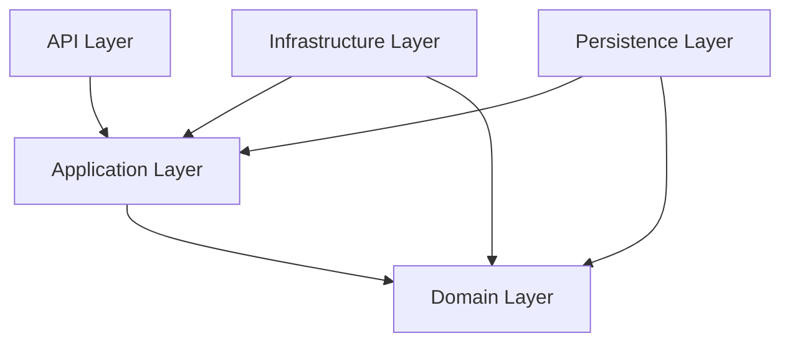
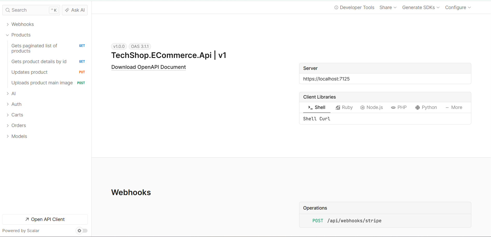

# 🛒 TechShop E-Commerce System

[](https://dotnet.microsoft.com/download/dotnet/10.0)
[](https://www.postgresql.org/)
[](https://redis.io/)
[](https://github.com/TrongNghia-17/TechShop.ECommerce)
[](https://opensource.org/licenses/MIT)

## 📌 Tổng quan dự án (Overview)
**TechShop.ECommerce** là một giải pháp thương mại điện tử (E-commerce) hiện đại, mạnh mẽ, và có khả năng mở rộng cao, được xây dựng trên nền tảng **.NET 10**. Dự án áp dụng triệt để mô hình **Clean Architecture** kết hợp cùng các công nghệ tiên tiến nhất hiện nay như **PostgreSQL (với Pgvector)**, **Redis Hybrid Cache**, **Stripe API**, và **OpenTelemetry**.

Hệ thống được thiết kế không chỉ để xử lý các nghiệp vụ bán hàng cơ bản mà còn tích hợp các tính năng thông minh như tìm kiếm bằng vector (AI-powered similarity search), xử lý tác vụ ngầm (Background Jobs), và giám sát hệ thống toàn diện.

---

## 🏗️ Kiến trúc hệ thống (Architecture)
Hệ thống được thiết kế theo mô hình **Clean Architecture** (Onion Architecture), tách biệt hoàn toàn logic nghiệp vụ (Domain/Application) khỏi hạ tầng (Infrastructure/Persistence).



- **`Core.Domain`**: Chứa các thực thể, Value Objects, Domain Exceptions và các Interface.
- **`Core.Application`**: Triển khai logic nghiệp vụ (CQRS with MediatR), validation, và mapping.
- **`Infrastructure.Persistence`**: Quản lý truy xuất dữ liệu với **EF Core** và **PostgreSQL (Pgvector)**.
- **`Infrastructure.Infrastructure`**: Cài đặt các dịch vụ bên thứ ba (Stripe, SendGrid, Azure Blobs, Redis, Hangfire).

---

## 🛠️ Công nghệ sử dụng (Tech Stack)

### Core Technologies
- **Framework**: [.NET 10.0 (Latest)](https://dotnet.microsoft.com/download)
- **Database**: [PostgreSQL](https://www.postgresql.org/) + [Pgvector](https://github.com/pgvector/pgvector-dotnet)
- **Caching**: [Redis](https://redis.io/) với **Microsoft.Extensions.Caching.Hybrid**
- **Authentication**: JWT & ASP.NET Core Identity

### Third-party Integrations
- **Payment Gateway**: [Stripe](https://stripe.com/)
- **Background Jobs**: [Hangfire](https://www.hangfire.io/) (với PostgreSQL Storage)
- **Email Service**: [SendGrid](https://sendgrid.com/)
- **Storage**: Azure Blob Storage
- **PDF Generation**: [QuestPDF](https://www.questpdf.com/)
- **Image Processing**: [SixLabors.ImageSharp](https://sixlabors.com/)

---

## 📸 Giao diện ứng dụng (Screenshots)

### API Documentation (Scalar)


---

## 🚀 Tính năng nổi bật (Key Features)

- ✅ **Product Management**: Quản lý sản phẩm đa biến thể, tích hợp tìm kiếm thông minh bằng **Vector Search**.
- ✅ **Shopping Cart & Orders**: Hệ thống giỏ hàng linh hoạt và quy trình đặt hàng chặt chẽ.
- ✅ **Secure Payments**: Tích hợp thanh toán trực tuyến an toàn qua **Stripe**.
- ✅ **Hybrid Caching**: Sử dụng hệ thống cache kết hợp (Memory + Redis) tối ưu hiệu năng.
- ✅ **Automated Background Jobs**: Tự động hóa gửi mail và đồng bộ hóa bằng **Hangfire**.
- ✅ **PDF Invoices**: Tự động xuất hóa đơn PDF bằng **QuestPDF**.
- ✅ **Advanced Observability**: Theo dõi hiệu năng và lỗi qua **OpenTelemetry** và **Seq**.

---

## 📥 Hướng dẫn cài đặt (Installation)

### 📋 Yêu cầu hệ thống (Prerequisites)
- [.NET 10 SDK](https://dotnet.microsoft.com/en-us/download/dotnet/10.0)
- [Docker Desktop](https://www.docker.com/products/docker-desktop/)
- [Git](https://git-scm.com/)

### 🛠️ Các bước thực hiện

1.  **Clone mã nguồn**:
    ```bash
    git clone https://github.com/TrongNghia-17/TechShop.ECommerce.git
    cd TechShop.ECommerce
    ```

2.  **Khởi động hạ tầng (Docker)**:
    Sử dụng Docker Compose để khởi động PostgreSQL, Redis, Seq, và OTel Collector:
    ```bash
    cd docker
    docker-compose up -d
    cd ..
    ```

3.  **Khởi tạo Database**:
    ```bash
    dotnet ef database update --project src/Infrastructure/TechShop.ECommerce.Persistence --startup-project src/API/TechShop.ECommerce.Api
    ```

4.  **Chạy ứng dụng**:
    ```bash
    dotnet run --project src/API/TechShop.ECommerce.Api
    ```

5.  **Truy cập vào Scalar API Documentation**:
    Mở trình duyệt: `https://localhost:PORT/scalar/v1`

---

## 🤝 Đóng góp (Contributing)
Mọi đóng góp nhằm cải thiện hệ thống đều được hoan nghênh. Vui lòng xem qua [CONTRIBUTING.md](CONTRIBUTING.md) trước khi bắt đầu.

## 📄 Giấy phép (License)
Dự án được phát hành dưới giấy phép **MIT**. Xem file [LICENSE](LICENSE) để biết thêm chi tiết.

---
⭐ Nếu bạn thấy dự án này hữu ích, hãy cho mình một **Star** trên GitHub nhé!

---
⭐ Nếu bạn thấy dự án này hữu ích, hãy cho mình một **Star** trên GitHub nhé!
