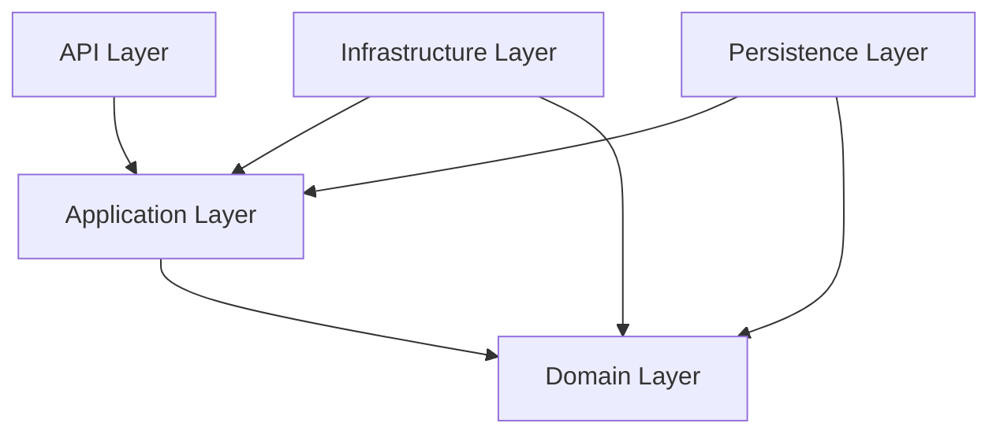

# 🛒 TechShop E-Commerce System

[](https://dotnet.microsoft.com/download/dotnet/10.0)
[](https://www.postgresql.org/)
[](https://redis.io/)
[](https://learn.microsoft.com/en-us/entra/external-id/)
[](https://github.com/TrongNghia-17/TechShop.ECommerce)
[](https://opensource.org/licenses/MIT)

## 📌 Tổng quan dự án (Overview)
**TechShop.ECommerce** là một giải pháp thương mại điện tử (E-commerce) hiện đại, mạnh mẽ, và có khả năng mở rộng mức Enterprise, được xây dựng trên nền tảng **.NET 10**. Dự án áp dụng triệt để mô hình **Clean Architecture** kết hợp cùng các công nghệ chuẩn 2026 như **PostgreSQL (với Pgvector)**, **Redis Hybrid Cache**, quản lý định danh với **Microsoft Entra ID**, thanh toán qua **Stripe API**, và giám sát qua **OpenTelemetry**.

Hệ thống được thiết kế không chỉ để xử lý các nghiệp vụ bán hàng cơ bản mà còn tích hợp các tính năng thông minh như tìm kiếm bằng vector (AI-powered similarity search), xử lý tác vụ ngầm (Background Jobs), và hệ thống quản lý định danh người dùng an toàn, hỗ trợ Social Login.

---

## 🏗️ Kiến trúc hệ thống (Architecture)
Hệ thống được thiết kế theo mô hình **Clean Architecture** (Onion Architecture), tách biệt hoàn toàn logic nghiệp vụ (Domain/Application) khỏi hạ tầng (Infrastructure/Persistence).



- **`Core.Domain`**: Chứa các thực thể, Value Objects, Domain Exceptions và các Interface.
- **`Core.Application`**: Triển khai logic nghiệp vụ (CQRS with MediatR), validation, và mapping.
- **`Infrastructure.Persistence`**: Quản lý truy xuất dữ liệu với **EF Core** và **PostgreSQL (Pgvector)**.
- **`Infrastructure.Infrastructure`**: Cài đặt các dịch vụ bên thứ ba (**Microsoft Entra ID**, Stripe, SendGrid, Azure Blobs, Redis, Hangfire).

---

## 🛠️ Công nghệ sử dụng (Tech Stack)

### Core Technologies
- **Framework**: [.NET 10.0 (Latest)](https://dotnet.microsoft.com/download)
- **Database**: [PostgreSQL](https://www.postgresql.org/) + [Pgvector](https://github.com/pgvector/pgvector-dotnet) cho Smart Search.
- **Caching**: [Redis](https://redis.io/) với **Microsoft.Extensions.Caching.Hybrid**
- **Authentication & Identity**: [Microsoft Entra ID (External ID)](https://learn.microsoft.com/en-us/entra/external-id/) thay thế Identity thông thường, cung cấp giải pháp xác thực Enterprise bảo mật 2FA, OAuth2/OIDC, và Social Login (Facebook, Google...).

### Third-party Integrations
- **Payment Gateway**: [Stripe](https://stripe.com/)
- **Background Jobs**: [Hangfire](https://www.hangfire.io/) (với PostgreSQL Storage)
- **Email Service**: [SendGrid](https://sendgrid.com/)
- **Storage**: Azure Blob Storage
- **PDF Generation**: [QuestPDF](https://www.questpdf.com/)
- **Image Processing**: [SixLabors.ImageSharp](https://sixlabors.com/)

---

## 🚀 Tính năng nổi bật (Key Features)

- 🔐 **Enterprise Identity (Entra ID)**: Quản lý xác thực và phân quyền chuẩn bảo mật cao cấp với hệ sinh thái của Microsoft, hỗ trợ đăng nhập một chạm qua mạng xã hội, quản lý thuộc tính người dùng mở rộng.
- 🧠 **Vector Smart Search**: Tìm kiếm sản phẩm thông minh, gợi ý bằng AI (AI-powered similarity search) thông qua sức mạnh của **Pgvector**.
- 📦 **Product Management**: Quản lý sản phẩm đa biến thể (variants).
- 🛒 **Shopping Cart & Orders**: Hệ thống giỏ hàng linh hoạt và quy trình đặt hàng chặt chẽ.
- 💳 **Secure Payments**: Tích hợp thanh toán trực tuyến mượt mà và an toàn qua thẻ với hệ thống **Stripe**.
- ⚡ **Hybrid Caching**: Sử dụng hệ thống cache đa tầng cực nhanh (Memory + Redis) tối ưu hiệu năng và khả năng chịu tải cao.
- ⚙️ **Automated Background Jobs**: Tự động xử lý bất đồng bộ (gửi email hóa đơn, đồng bộ data...) qua **Hangfire**.
- 🧾 **PDF Invoices**: Tự động xuất hóa đơn sắc nét, chuyên nghiệp bằng định dạng PDF qua **QuestPDF**.
- 📊 **Advanced Observability**: Monitoring tối tân, theo dõi hiệu năng và tracing mạnh mẽ nhờ **OpenTelemetry** kết nối hệ thống log **Seq**.

---

## 📥 Hướng dẫn cài đặt (Installation)

### 📋 Yêu cầu hệ thống (Prerequisites)
- [.NET 10 SDK](https://dotnet.microsoft.com/en-us/download/dotnet/10.0)
- [Docker Desktop](https://www.docker.com/products/docker-desktop/)
- [Git](https://git-scm.com/)
- Cấu hình Application/Tenant của **Microsoft Entra ID**

### 🛠️ Các bước thực hiện

1.  **Clone mã nguồn**:
    ```bash
    git clone https://github.com/TrongNghia-17/TechShop.ECommerce.git
    cd TechShop.ECommerce
    ```

2.  **Cấu hình Môi trường**:
    Cập nhật cấu hình bảo mật `EntraId` (TenantId, ClientId...), `Stripe` API Keys và `ConnectionStrings` trong `appsettings.Development.json` hoặc thông qua User Secrets.

3.  **Khởi động hạ tầng (Docker)**:
    Sử dụng Docker Compose để khởi động PostgreSQL, Redis, Seq, và OTel Collector:
    ```bash
    cd docker
    docker-compose up -d
    cd ..
    ```

4.  **Khởi tạo Database**:
    ```bash
    dotnet ef database update --project src/Infrastructure/TechShop.ECommerce.Persistence --startup-project src/API/TechShop.ECommerce.Api
    ```

5.  **Chạy ứng dụng**:
    ```bash
    dotnet run --project src/API/TechShop.ECommerce.Api
    ```

6.  **Truy cập vào API Documentation**:
    Mở trình duyệt: `https://localhost:PORT/scalar/v1` - (UI đã cấu hình sẵn luồng OAuth2 để xin Token trực tiếp để test).

---

## 🤝 Đóng góp (Contributing)
Mọi đóng góp nhằm cải thiện hệ thống đều được hoan nghênh. Vui lòng xem qua [CONTRIBUTING.md](CONTRIBUTING.md) trước khi bắt đầu.

## 📄 Giấy phép (License)
Dự án được phát hành dưới giấy phép **MIT**. Xem file [LICENSE](LICENSE) để biết thêm chi tiết.

---
⭐ Nếu bạn thấy dự án này hữu ích, hãy cho mình một **Star** trên GitHub nhé!
